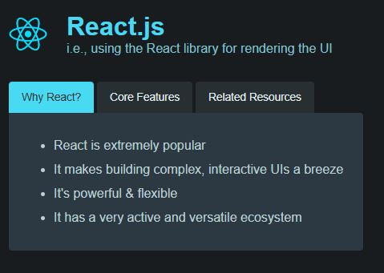
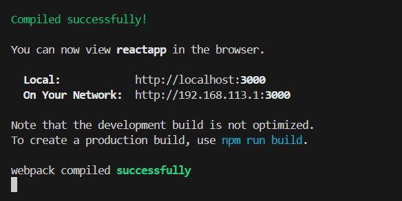
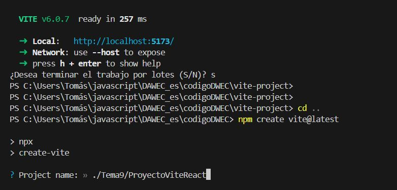
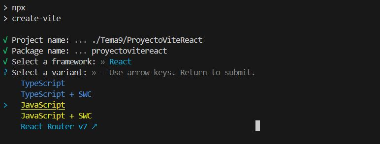

# **UNIDAD 09 - React**

## **1. Introducción**

[React](https://es.react.dev/) es una libreria para el desarrollo de aplicaciones web. Concretamente una librería javascript para construir interfactes web.  
React se basa en el uso de **componentes**, una fusión  `html` con `javascript`, escritos en **JSX (JavaScript XML)**. A través de JSX, se crea una copia de DOM (Modelo de Objetos del Documento) llamada **DOM virtual**. Si un componente cambia su estado, React compara el **DOM virtual** con el DOM real (de la página web) y aplica este cambio solamente al elemento que ha sido actualizado, sin necesidad de volver a renderizar toda la página.

### ¿Por qué usar **React**?
De hecho, JavaScript ya se encarga "por detrás", de cagar los datos que la página web necesita en función de la interacción del usuario (ir a una nueva pestaña, por ejemplo), diseñar la nueva página web, y presentarla al usuario de forma transparente a este. Y esto ha convertido a JS en un lenguaje demandado para la programación web.

Sin embargo, usar **sólo Javascript** en esencia no es una buena opción para proyectos realistas (recordemos que estamos evolucionando hacia SPA - Single Page Application, es decir, webs dónde sólo hay una página -vacia- que se va cargando con JS):

  - Crear **páginas complejas** (realistas), se puede convertir en algo **tortuoso**. Sobretodo en un proyecto real dónde los requisitos van cambiando.
  - JS (de verdad) es propenso a errores. No que la página no haga lo que debe, si no **que haga lo que no debe**.
  - Los proyectos de JS (de verdad) son **dificiles de entender** (benditos comentarios), y por tanto **mantener o editar**.
  

React ofrece una manera más lógica e intuitiva de estructurar una página web con las que ofrece soluciones a esas desventajas de JS:

  - Los componentes de React **agilizan la creación de una interfaz sensible a cualquier cambio** en un sitio web o una aplicación de cualquier complejidad.
  - Gracias al DOM virtual, la biblioteca **ahorra recursos y tráfico**.
  - El código de React tiene una **lógica clara**, es fácil de leer, entender y depurar, lo que ayuda a reducir errores.
  - Las interfaces interactivas creadas con React garantizan una **mejor experiencia de usuario**.
  - React es fácil de aprender, tiene una **documentación accesible** y muchos recursos gratuitos online.
  
Todo esto, hace que React sea una de las librerias/habilidades más demandadas para conseguir el trabajo de desarrollo Front End. Aunque también tiene algunos puntos en contra:

  - Necesidad de un conocimiento sólido de **HTML** y **JavaScript** para aprender la sintaxis de JXS.
  - La biblioteca puede **aumentar el tamaño de tu aplicación**.
  - React solo visualiza la interfaz, pero para crear un proyecto completo, se necesita una **pila de tecnología**.


## 1. **Características Modernas de JavaScript para el Desarrollo en React**

**1.1 Módulos de JavaScript**

¿Qué son los Módulos?

Importar y exportar funciones, objetos o valores de un archivo a otro.

**Sintaxis**

```javascript
// Exportando
export const greet = () => {
  console.log("¡Hola!");
};

// Importando
import { greet } from "./greetModule.js";
greet();
```

**1.2 Asignación por Desestructuración**

¿Qué es la Desestructuración?

Una sintaxis para desempaquetar valores de arrays o propiedades de objetos en variables distintas.

**Ejemplos**

```javascript
// Desestructuración de Array
const [first, second] = [1, 2, 3];
console.log(first, second); // Salida: 1, 2

// Desestructuración de Objetos
const user = { name: "Alice", age: 25 };
const { name, age } = user;
console.log(name, age); // Salida: Alice, 25
```

**3. Operadores Spread y Rest (...)**

**Operador Spread**

Se utiliza para expandir elementos de un array u objeto.

```javascript
const arr = [1, 2, 3];
const newArr = [...arr, 4, 5];
console.log(newArr); // Salida: [1, 2, 3, 4, 5]

const user = { name: "Alice", age: 25 };
const updatedUser = { ...user, location: "NY" };
console.log(updatedUser); // Salida: { name: 'Alice', age: 25, location: 'NY' }
```

**Operador Rest**

Se utiliza para recolectar argumentos en un array o las propiedades restantes en un objeto.

```javascript
const sum = (...numbers) => numbers.reduce((total, num) => total + num, 0);
console.log(sum(1, 2, 3)); // Salida: 6

const { name, ...rest } = { name: "Alice", age: 25, location: "NY" };
console.log(rest); // Salida: { age: 25, location: 'NY' }
```

**1.4 Funciones de Flecha**

¿Qué son las Funciones de Flecha?

Una sintaxis concisa para escribir funciones. También manejan el contexto de `this` de manera diferente a las funciones normales.

**Sintaxis**

```javascript
const add = (a, b) => a + b;
console.log(add(2, 3)); // Salida: 5
```

**1.5 Literales de Plantilla**

¿Qué son los Literales de Plantilla?

Una sintaxis para crear cadenas con expresiones incrustadas usando comillas invertidas.

**Ejemplos**

```javascript
const name = "Alice";
console.log(`¡Hola, ${name}!`); // Salida: ¡Hola, Alice!
```

**1.6 Parámetros por Defecto**

¿Qué son los Parámetros por Defecto?

Asignar valores predeterminados a los parámetros de una función.

**Ejemplos**

```javascript
const greet = (name = "Invitado") => `¡Hola, ${name}!`;
console.log(greet()); // Salida: ¡Hola, Invitado!
```


## **2. Código React y Código JS**

Vamos a ver una [página simple en Javascript (con vainilla)](https://codesandbox.io/p/devbox/hg2rkw), y después veremos una [página similar usando React](https://codesandbox.io/p/devbox/88hszh). 
Ambas están en mi repositorio.

### **2.1 JS y ya**


En una web basada en JS tenemos tres elementos principales: 

  - el archivo `html`, que es la página en si; 
  - el archivo `css` ~que sirve para cosas raras que vereis con Jose Enrique~ para dar formato a la web; 
  - y el archivo `.js` que se encarga de obtener los botones, configurar los listeners, gestionar el DOM y definir la funcionalidad cada vez que se pulsa un botón (cambiando el fondo de todos los botones, generando el texto, etc...). 

Todo esto es lo que hemos visto hasta ahora en el módulo.

### **2.2 React**

Una aplicación de **React** es un poco más compleja. Empezando porque se basa en una estructura de archivos y directorios muy bien definida. Más adelante la veremos en detalle.




Si echamos un vistazo, en la carpeta `/Public` tenemos 

- Un archivo `.html`, que está casi vacio: tiene un `<div>` que  es la carcasa de la web (SPA).
- El resto de elementos están en la carpeta `/src`, aunque hay más carpetas propias de la estructura de un proyecto **React**.
- El archivo`.js`, de hecho también está bastante vacío, y su función es solo para vincular el `html` con **React**, esto es, *a través del achivo `.js` se va a usar **React** para **renderizar** la pagina web*. De hecho la función `render` es un componente de React que está devolviendo etiquetas html **marcadas** (distinguirás estas etiquetas porque aparecen en mayúscula, aparte que el editor las marca con otro color). 

El archivo `App.js` tiene toda la "chicha": Tiene la función `app` que devuelve un código html muy parecido al html del ejemplo anterior ***¡¡¡¡Se está mezclando html con js!!!! ¡¡ay dios mio!!***. Por otra parte, no tenemos las instrucciones JavaScript pero si que tenemos algunas sentencias JS mezcladas en el codigo html ***to junto! que estres!!***. 

Si aparecen unos elementos que nos hablan del ***estado (o de los estados)*** de una página web. Estos estados los controla React, y se aplican a todos los elementos que integran la web.

 Para arrancar el proyecto, nos situamos con el terminal en la carpeta *react* y ejecuta el comando `npm start`.

### Programaciòn declarativa vs imperativa

En React se programa o configura el estado en el que tiene que estar todos los componentes de la página, no los pasos para llegar a ese estado. Por tanto la web va a estar siempre en un estado válido. Es lo que se denomina **Programación Declarativa** que basicamente consiste en decir como tiene que estar todo configurado, pero sin decir los pasos para configurarlo, que sería **Programación imperativa**.


La programación declarativa se basa en una máquina de estados, y las transiciones.

<div class="exercise-box">
    <h3><i class="fas fa-laptop-code"></i> Ejercicio Práctico: React o solo JS</h3>
    <p>1. Editemos ambas versiones de la web para añadir un cuarto botón, llamadlo como queráis. 
    NOta: Los arrais ya están preparados para ese botón</p>
    <p><u>Deberíamos cronometrarnos para ver lo que nos cuesta hacerlo con una y otra tecnología.</u></p>
</div>

## **3. Nuevo Proyecto**

Hay dos versiones a la hora de crear un proyecto: 

  - Por una parte podemos utilizar el gestor de paquetes **npm** que ya comentamos en el primer tema.
  - O el gestor **vite**

### **NPM**

De esto, comentar que `npm` es el gestor de paquetes de Node.js (recordemos que esto se basa en Node). Se usa para instalar y administrar dependencias.

Abrimos el terminal y procedemos con el comando `npm init react-app ruta y nombre de la aplicación`. 
`init` es el comando de npm para iniciar un nuevo proyecto. `react-app` es el paquete preconfigurado que se usa para crear una aplicacion de React con la estructura de directorios y archivos recomendada. `ruta y nombre de la aplicación` pues la ruta y el nombre del proyecto.

Es muy probable que dé error por problemas con dependencias, para solucionarlo, añadimos `--legacy-peer-dep`.

Ya tenemos el proyecto creado. Ahora hay que meterle cosillas. Bueno, ya le meteremos cosillas luego. Ahora lo importante es arrancar la app que acabamos de crear.

En primer lugar, nos movemos al directorio de la aplicación `cd ruta completa del directorio`. Después arrancamos React en ese directorio `npm start`. El resultado nos debe mostrar las direcciones tanto local como de red desde las que son visible nuestra web.



Y taaachaaaaaannn: Ya funciona.
 Puede dar fallos. si los da, ejecutamos `npm install ajv@latest ajv-keywords@latest ´--legacy-peer-dep` y volvemos a lanzar `npm start`.


... y ahora si :) se debe abrir el navegador con nuestra página (en blanco).


### **React y Vite**

Si queremos usar React con Vite, simplemente debemos seguir los siguientes pasos:


   - Abrir una terminal (como siempre, os acordáis de cuánto odiabais los comandos en SiSi... quién nos iba a decir...)
   - Escribimos `npm create vite@latest`, con esto creamos un proyecto de Vite, pero OJO, que nos va a pedir cosillas:
      - En primer lugar, nos va a pedir permiso para crear los paquetes. Decimos que `y`es.
      - Después nos pide un *nombre* para el proyecto. Recordad que creará una carpeta con el nombre del proyecto en el directorio actual, y dentro creará toda la estrucura del proyecto. Si forzamos la creación de directorios intermedios, asumirá que le hemos dado la *ruta* y nos volverá a pedir *nombre* del proyecto. 
      - El *framework* que vamos a utilizar  y podremos desplazarnos con las flechas.
      - El *lenguaje*, 
  - Con esto, ya tendremos creado el proyecto Vite. Si todo ha ido bien nos mostrará una imagen con más info: 
   - Ahora solo tenemos que ejecutar los tres comandos que nos dice Vite:
     - Nos vamos a la carpeta del directorio creado `  cd Tema9\ProyectoViteReact`
     - Instalamos los paquetes de Vite `  npm install`. Tarda un poco, tened paciencia!.
     - Ejecutamos la aplicación  ` npm run dev`
   - Y obtenemos este resultado:  Aqui podemos ver la dirección en localhost dónde se está mostrando la página, y cómo podemos acceder a los archivos de código. Por otra parte, se habrá creado el proyecto React con la estructura de directorios y ficheros vista . Y por supuesto, en el navegador, podemos ver nuestra primera página .
  

  

## **4. ¿Qué es React? ¿Y Porqué React**

Para explicar esta parte, voy a usar unas transparencias que me he encontrado.


