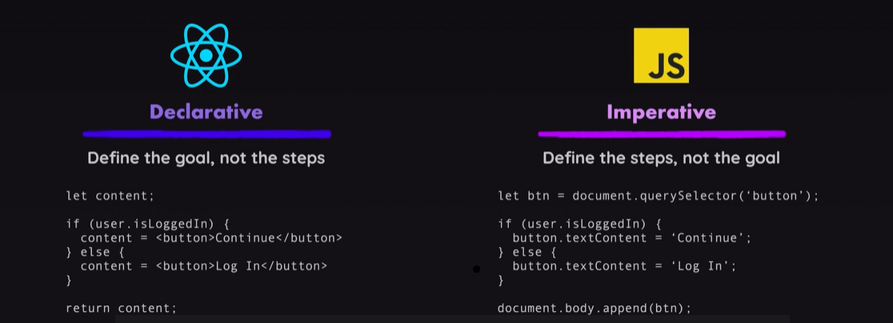
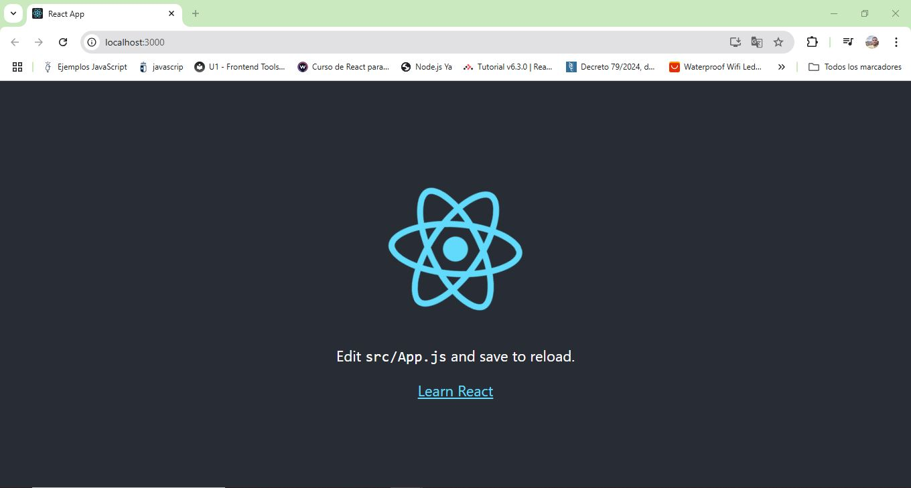
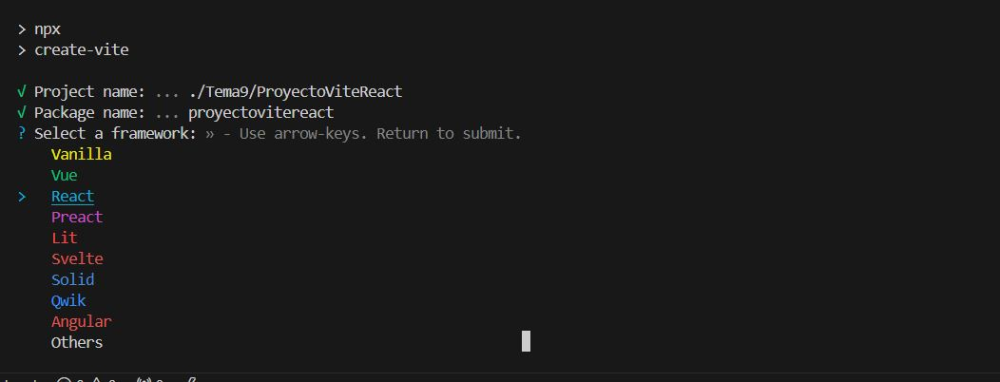
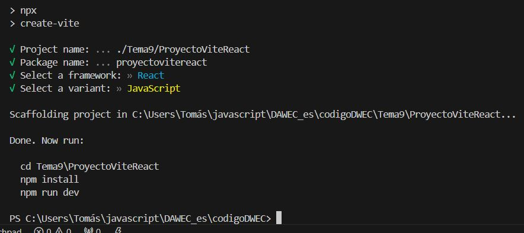
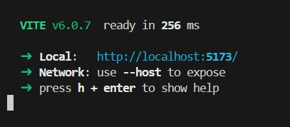
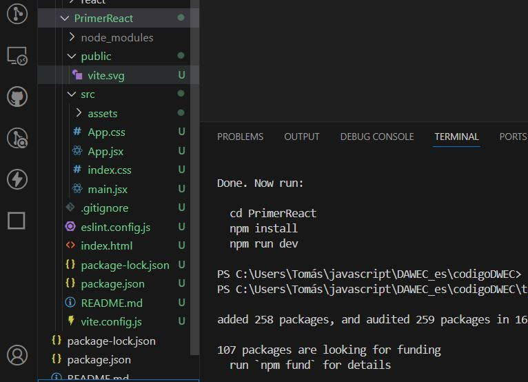
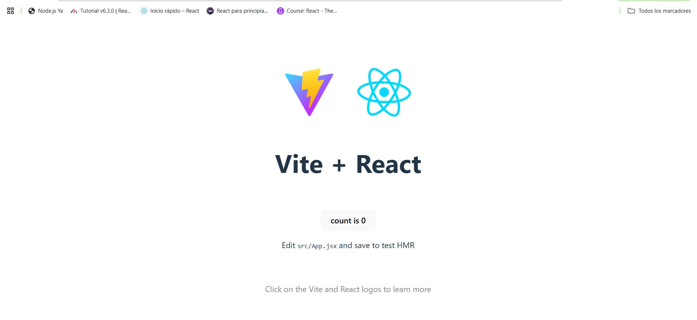

# **UNIDAD 09 - React**

## **1. Introducción**

[React](https://es.react.dev/) es una libreria para el desarrollo de aplicaciones web. Concretamente una librería javascript para construir interfactes web.  
React se basa en el uso de **componentes**, una fusión `html` con `javascript`, escritos en **JSX (JavaScript XML)**. A través de JSX, se crea una copia de DOM (Modelo de Objetos del Documento) llamada **DOM virtual**. Si un componente cambia su estado, React compara el **DOM virtual** con el DOM real (de la página web) y aplica este cambio solamente al elemento que ha sido actualizado, sin necesidad de volver a renderizar toda la página.

### **¿Por qué usar _React_?**

De hecho, JavaScript ya se encarga "por detrás", de cagar los datos que la página web necesita en función de la interacción del usuario (ir a una nueva pestaña, por ejemplo), diseñar la nueva página web, y presentarla al usuario de forma transparente a este. Y esto ha convertido a JS en un lenguaje demandado para la programación web.

Sin embargo, usar **sólo Javascript** en esencia no es una buena opción para proyectos realistas (recordemos que estamos evolucionando hacia SPA - Single Page Application, es decir, webs dónde sólo hay una página -vacia- que se va cargando con JS):

- Crear **páginas complejas** (realistas), se puede convertir en algo **tortuoso**. Sobretodo en un proyecto real dónde los requisitos van cambiando.
- JS (de verdad) es propenso a errores. No que la página no haga lo que debe, si no **que haga lo que no debe**.
- Los proyectos de JS (de verdad) son **dificiles de entender** (benditos comentarios), y por tanto **mantener o editar**.

React ofrece una manera más lógica e intuitiva de estructurar una página web con las que ofrece soluciones a esas desventajas de JS:

- Los componentes de React **agilizan la creación de una interfaz sensible a cualquier cambio** en un sitio web o una aplicación de cualquier complejidad.
- Gracias al DOM virtual, la biblioteca **ahorra recursos y tráfico**.
- El código de React tiene una **lógica clara**, es fácil de leer, entender y depurar, lo que ayuda a reducir errores.
- Las interfaces interactivas creadas con React garantizan una **mejor experiencia de usuario**.
- React es fácil de aprender, tiene una **documentación accesible** y muchos recursos gratuitos online.

Todo esto, hace que React sea una de las librerias/habilidades más demandadas para conseguir el trabajo de desarrollo Front End. Aunque también tiene algunos puntos en contra:

- Necesidad de un conocimiento sólido de **HTML** y **JavaScript** para aprender la sintaxis de JXS.
- La biblioteca puede **aumentar el tamaño de tu aplicación**.
- React solo visualiza la interfaz, pero para crear un proyecto completo, se necesita una **pila de tecnología**.

## **2. Fundamentos de React**

La parte de Fundamentos de React, así como la evolución desde el punto de vista del desarrollo del código que implica React, está más o menos explicada en estas transparencias.

[Fundamentos de React](slides/1._Fundamentals.pdf)

## **3. Características Modernas de JavaScript para el Desarrollo en React**

###**3.1 Módulos de JavaScript**

¿Qué son los Módulos?

Importar y exportar funciones, objetos o valores de un archivo a otro.

**Sintaxis**

```javascript
// Exportando
export const greet = () => {
  console.log("¡Hola!");
};

// Importando
import { greet } from "./greetModule.js";
greet();
```

### **3.2 Asignación por Desestructuración**

¿Qué es la Desestructuración?

Una sintaxis para desempaquetar valores de arrays o propiedades de objetos en variables distintas.

**Ejemplos**

```javascript
// Desestructuración de Array
const [first, second] = [1, 2, 3];
console.log(first, second); // Salida: 1, 2

// Desestructuración de Objetos
const user = { name: "Alice", age: 25 };
const { name, age } = user;
console.log(name, age); // Salida: Alice, 25
```

### **3.3. Operadores Spread y Rest (...)**

#### **Operador Spread**

Se utiliza para expandir elementos de un array u objeto.

```javascript
const arr = [1, 2, 3];
const newArr = [...arr, 4, 5];
console.log(newArr); // Salida: [1, 2, 3, 4, 5]

const user = { name: "Alice", age: 25 };
const updatedUser = { ...user, location: "NY" };
console.log(updatedUser); // Salida: { name: 'Alice', age: 25, location: 'NY' }
```

#### **Operador Rest**

Se utiliza para recolectar argumentos en un array o las propiedades restantes en un objeto.

```javascript
const sum = (...numbers) => numbers.reduce((total, num) => total + num, 0);
console.log(sum(1, 2, 3)); // Salida: 6

const { name, ...rest } = { name: "Alice", age: 25, location: "NY" };
console.log(rest); // Salida: { age: 25, location: 'NY' }
```

### **3.4 Funciones de Flecha**

¿Qué son las Funciones de Flecha?

Una sintaxis concisa para escribir funciones. También manejan el contexto de `this` de manera diferente a las funciones normales.

**Sintaxis**

```javascript
const add = (a, b) => a + b;
console.log(add(2, 3)); // Salida: 5
```

### **3.5 Literales de Plantilla**

¿Qué son los Literales de Plantilla?

Una sintaxis para crear cadenas con expresiones incrustadas usando comillas invertidas.

**Ejemplos**

```javascript
const name = "Alice";
console.log(`¡Hola, ${name}!`); // Salida: ¡Hola, Alice!
```

### **3.6 Parámetros por Defecto**

¿Qué son los Parámetros por Defecto?

Asignar valores predeterminados a los parámetros de una función.

**Ejemplos**

```javascript
const greet = (name = "Invitado") => `¡Hola, ${name}!`;
console.log(greet()); // Salida: ¡Hola, Invitado!
```

## **4. Código React y Código JS**

Vamos a ver una [página simple en Javascript (con vainilla)](https://codesandbox.io/p/devbox/hg2rkw), y después veremos una [página similar usando React](https://codesandbox.io/p/devbox/88hszh).
Ambas están en mi repositorio.

### **4.1 JS y ya**


En una web basada en JS tenemos tres elementos principales:

- el archivo `html`, que es la página en si;
- el archivo `css` ~que sirve para cosas raras que vereis con Jose Enrique~ para dar formato a la web;
- y el archivo `.js` que se encarga de obtener los botones, configurar los listeners, gestionar el DOM y definir la funcionalidad cada vez que se pulsa un botón (cambiando el fondo de todos los botones, generando el texto, etc...).

Todo esto es lo que hemos visto hasta ahora en el módulo.

### **4.2 React**

Una aplicación de **React** es un poco más compleja. Empezando porque se basa en una estructura de archivos y directorios muy bien definida. Más adelante la veremos en detalle.


Si echamos un vistazo, en la carpeta `/Public` tenemos

- Un archivo `.html`, que está casi vacio: tiene un `<div>` que es la carcasa de la web (SPA).
- El resto de elementos están en la carpeta `/src`, aunque hay más carpetas propias de la estructura de un proyecto **React**.
- El archivo`.js`, de hecho también está bastante vacío, y su función es solo para vincular el `html` con **React**, esto es, _a través del achivo `.js` se va a usar **React** para **renderizar** la pagina web_. De hecho la función `render` es un componente de React que está devolviendo etiquetas html **marcadas** (distinguirás estas etiquetas porque aparecen en mayúscula, aparte que el editor las marca con otro color).

El archivo `App.js` tiene toda la "chicha": Tiene la función `app` que devuelve un código html muy parecido al html del ejemplo anterior **_¡¡¡¡Se está mezclando html con js!!!! ¡¡ay dios mio!!_**. Por otra parte, no tenemos las instrucciones JavaScript pero si que tenemos algunas sentencias JS mezcladas en el codigo html **_to junto! que estres!!_**.

Si aparecen unos elementos que nos hablan del **_estado (o de los estados)_** de una página web. Estos estados los controla React, y se aplican a todos los elementos que integran la web.

Para arrancar el proyecto, nos situamos con el terminal en la carpeta _react_ y ejecuta el comando `npm start`.

### **4.3 _Programaciòn declarativa_ vs _imperativa_**

En React se programa o configura el estado en el que tiene que estar todos los componentes de la página, no los pasos para llegar a ese estado. Por tanto la web va a estar siempre en un estado válido. Es lo que se denomina **Programación Declarativa** que basicamente consiste en decir como tiene que estar todo configurado, pero sin decir los pasos para configurarlo, que sería **Programación imperativa**.



La programación declarativa se basa en una máquina de estados, y las transiciones entre estados.

<div class="exercise-box">
    <h3><i class="fas fa-laptop-code"></i> Ejercicio Práctico: React o solo JS</h3>
    <p>1. Editemos ambas versiones de la web para añadir un cuarto botón, llamadlo como queráis. 
    NOta: Los arrais ya están preparados para ese botón</p>
    <p><u>Deberíamos cronometrarnos para ver lo que nos cuesta hacerlo con una y otra tecnología.</u></p>
</div>

## **5. Preparación del entorno**

Hay varias versiones a la hora de crear un proyecto en React:

- "A pelo". Usando el gestor de paquetes [**npm**](https://www.npmjs.com/) que ya comentamos en el primer tema.
- O con el bundler de [**vite**](https://vite.dev/).

### **5.1 NPM**

De esto, comentar que `npm` es el gestor de paquetes de Node.js (recordemos que esto se basa en Node). Se usa para instalar y administrar dependencias.

Abrimos el terminal y procedemos con el comando:

```bash
npm init react-app ruta y nombre de la aplicación
```

`init` es el comando de npm para iniciar un nuevo proyecto. `react-app` es el paquete preconfigurado que se usa para crear una aplicacion de React con la estructura de directorios y archivos recomendada. `ruta y nombre de la aplicación` pues la ruta y el nombre del proyecto.

Es muy probable que dé error por problemas con dependencias, para solucionarlo, añadimos al comando:

```bash
--legacy-peer-dep
```

con esto le estamos diciendo que resuelva los problemas de dependencias que se encuentre. En general, esta opción nos será bastante útil cada vez que tengamos problemas con las dependencias

Ya tenemos el proyecto creado. Ahora hay que meterle cosillas. Bueno, ya le meteremos cosillas luego. Ahora lo importante es arrancar la app que acabamos de crear.

En primer lugar, nos movemos al directorio de la aplicación `cd ruta completa del directorio`. Después arrancamos React en ese directorio

```bash
npm start
```

El resultado nos debe mostrar las direcciones tanto local como de red desde las que son visible nuestra web.


Y si no ha habido ningún fallo de última hora, ya debería funcionar. Puede dar fallos. si los da, ejecutamos

```bash
npm install ajv@latest ajv-keywords@latest --legacy-peer-dep
```

y volvemos a lanzar `npm start`. Y ahora si se debe abrir el navegador con nuestra página (en blanco).



### **5.2 React con Vite**

Si queremos usar React con Vite, simplemente debemos seguir los siguientes pasos:

- Abrir una terminal (como siempre, os acordáis de cuánto odiabais los comandos en SiSi... quién nos iba a decir...)
- Escribimos

```bash
npm create vite@latest
```

con esto creamos un proyecto de Vite, pero OJO, que nos va a pedir cosillas: - En primer lugar, nos va a pedir permiso para crear los paquetes. Decimos que `y`es. - Después nos pide un _nombre_ para el proyecto. Recordad que creará una carpeta con el nombre del proyecto en el directorio actual, y dentro creará toda la estrucura del proyecto. Si forzamos la creación de directorios intermedios, asumirá que le hemos dado la _ruta_ y nos volverá a pedir _nombre_ del proyecto.  - El _framework_ que vamos a utilizar  y podremos desplazarnos con las flechas. - El _lenguaje_, 

- Con esto, ya tendremos creado el proyecto Vite. Si todo ha ido bien nos mostrará una imagen con más info: 
- Ahora solo tenemos que ejecutar los tres comandos que nos dice Vite:
  - Nos vamos a la carpeta del directorio creado `  cd Tema9\ProyectoViteReact` (Recordad ios a la carpeta que hayais puesto en vuestro proyecto)
  - Instalamos los paquetes de Vite

```bash
npm install
```

Tarda un poco, tened paciencia!. - Actualizamos los paquetes de React y ReactDOM que se han instalado

```bash
npm install  react@latest react-dom@latest
```

     - Ejecutamos la aplicación

```bash
npm run dev
```

- Y obtenemos este resultado:  Aqui podemos ver la dirección en localhost dónde se está mostrando la página, y cómo podemos acceder a los archivos de código. Por otra parte, se habrá creado el proyecto React con la estructura de directorios y ficheros vista . Y por supuesto, en el navegador, podemos ver nuestra primera página .

### **5.3 Configuración del entorno de desarrollo para trabajar con React**

Esta parte se basa en las transparencias [setup React](slides/2._Setup.pdf), pero las adapta a una distribución en VSCode.

Para recapitular, en el desarrollo de un proyecto con React vamos a necesitar algunos elementos:

- Las librerías de React y React-DOM, que se han instalado al crear el proyecto de React en la sección anterior
- Un gestor de contenido, que sería `npm` o `yarn`, aunque el primero ya lo tenenos puesto.
- Si hemos hecho la instalación con Vite, el se va a encargar de empaquetar el código que generemos

Ahora es el momento de instalar algunas liberias y paquetes de desarrollo:

#### **Linting**

Cualquier _Lintern_ tiene el objetivo de revisar, analizar y mejorar nuestro código, conforme vamos escribiendo. No sólo detecta errores que provocarían _no compilar_, si no que detecta malas prácticas, inconsistencias y otros fallos en el código fuente.
Por otra parte, sugiere mejoras de estilo y optimizaciones en cuanto a la escritura de código. Aunque debemos recordar que al final cada desarrollador _desarrolla_ su propia forma de programar. También detecta variables o funciones no usadas.
Salvo que sean errores propios del lenguaje (que el compilador detectaría, o que llevaría a un error en el caso de lenguajes interpretados), los errores que detecta un lintern generalmente no impiden que el código se ejecute bien.
Por esto, a veces las líneas rojas que marca el Lintern pueden sacar de quicio a un programador novel.

Podemos encontrarnos varios Linterns (algunos incluso están como pluguins de VSCode):

- [**ESLint**](https://eslint.org/) es el más utilizado en proyecto se React. Detecta problemas de código, errores de sintaxis y problemas específicos de React. Además, permite definir reglas personalizables e incorporar estilos predefinidos (Airbnb, Standard, etc.). Las reglas principalmente se usan en grandes equipos de desarrollo, para unificar la manera de programar de todos los integrantes.
- **Style-lint** para mantener un estilo uniforme en las hojas de estilo.

**Eslint** ya viene añadido al proyecto si lo hemos creado con **Vite**.
Sin embargo, también se recomienda instalar [**Airbnb**](https://airbnb.io/javascript/).
Estas son unas reglas creadas por la empresa homónima que se enfocan en:

- Mejorar la **consistencia** para que el código se vea y comporte de la misma forma en todo el proyecto.
- Garantizar la **legibilidad**, sobretodo pensando en que otros desarrolladores, o tu mismo, pero en otro momento, tengan que entender _qué_ hace el código.
- Prevenir **errores**, al menos los más comunes.

Las principales características de Airbnb son:

- Reglas de formato
  - Uso de comillas simples (') en lugar de dobles (").
  - Indentación de 2 espacios.
  - Uso de punto y coma (;) al final de cada línea.
  - Buenas prácticas:
    - Prohíbe el uso de variables no declaradas.
    - Requiere el uso de const o let en lugar de var.
    - Sugiere usar funciones flecha (=>) siempre que sea posible.
  - Específico para React:
    - Requiere propTypes o TypeScript para la validación de propiedades.
    - Promueve el uso de fragmentos (<></>) en lugar de div innecesarios.
    - Obliga a seguir buenas prácticas en los hooks de React.
  - Compatibilidad con ES6+:
    - Promueve el uso de destructuración de objetos y arrays.
    - Sugiere usar template literals para la concatenación de cadenas.

#### **Pretier**

[**Prettier**](https://prettier.io/) es una herramienta de formateo de código que se acopla con _Eslint_, nos permite basicamente hacer un formateo automático del código (esto es, añadir ; al final de cada línea de js, si así lo decidimos). Con ello, logramos un estilo consistente.
instalar pretieer

#### **Huski**

[**Husky**]() es uan herramienta que permite ejecutar ganchos (llamados hooks, como el capitán Hook) de git en los proyectos.
Los ganchos son scripts que se ejecutan en ciertos momentos clave del proyecto, como la compilación, o la subida al repositiorio de forma automática.

- Automatización de tareas: Puedes configurar Husky para ejecutar tareas automáticamente, como linters, pruebas o formateadores, antes de realizar commits o push.
- Prevención de errores: Garantiza que el código que se sube al repositorio cumpla con los estándares y no contenga errores básicos.
- Flujo de trabajo colaborativo: Asegura que todo el equipo siga las mismas reglas de calidad y estilo.

### **5.4 Instalación de las extensiones en nuestro proyecto**

instalando react

1. cofiguramos eslint y prettier como formatter dentro de code:
   en settings buscamos formatter y le indicadmos que es prettier; además buscamos la opción de format on save

2. comprobamos que tengamos instalado npm y node
   npm -v
   node -v

3. instalamos yarn (por si acaso)
   npm install -g yarn

4. Creamos el proyecto con vite
   npm create vite@latest, y seguimos el proceso de creación e instalación, salvo por la parte de levantar la web

5. actualizamos los paquetes de react y react-dom, para que tengan la últia versión
   npm install react@latest react-dom@latest
   y lo comprobamos
   npm list react react-dom

AHORA VIENE LO BUENO. (añadimos @latest en todos los paquetes, y --legacy-peer-deps en todos los comandosssssssssssssssssssssssssssssssssssssa

6 instalamos eslint con las reglsa de airbnb
npm install eslint@latest eslint-config-airbnb@latest eslint-plugin-react@latest eslint-plugin-react-hooks@latest eslint-plugin-jsx-a11y@latest eslint-plugin-import@latest eslint-plugin-react-refresh@latest --save-dev --legacy-peer-deps
si estuvieramos usando typescript, tb añadimos
npm install @typescript-eslint/parser @typescript-eslint/eslint-plugin --save-dev

7 inicializamos eslint
npx eslint --init , ojo que al final, le he dicho que uso el yarn y no el npm como gestor de paquetes

-- no da fallo, pero si deberia crear el archivo .eslintrc. lo creamos y añadimos el código

{
"env": {
"browser": true,
"es2021": true
},
"extends": [
"airbnb",
"airbnb/hooks",
"eslint:recommended",
"plugin:react/recommended",
"plugin:react-hooks/recommended"
],
"parserOptions": {
"ecmaVersion": 2021,
"sourceType": "module",
"ecmaFeatures": {
"jsx": true
}
},
"plugins": ["react", "react-hooks"],
"rules": {
"react/react-in-jsx-scope": "off", // No es necesario importar React en Vite.
"react/jsx-filename-extension": [1, { "extensions": [".js", ".jsx", ".ts", ".tsx"] }]
}
}

8 instalamos prettier
npm install prettier@latest eslint-config-prettier@latest eslint-plugin-prettier@latest --save-dev --legacy-peer-deps

vuelve a dar fallo por dependencias. la alternativa sería usar yarn :
yarn add prettier eslint eslint-config-airbnb --dev

9. cfreamos el archivo .prettierrc con este codigo
   {
   "semi": true,
   "singleQuote": true,
   "trailingComma": "all",
   "printWidth": 80,
   "tabWidth": 2
   }

10 creamos el archivo .prettierignore con este codigo
node_modules
dist
build

11 en el archivo .eslintrc que hemos creado en unpaso anterior, añadimos esta linea dentro de los exports

,
"plugin:prettier/recommended"

en los scripts del package.json añadimos
"format": "prettier --write .", para que se encargeu de formatearnos

12 instalamos husky y lintstaged
npm install husky lint-staged --save-dev

arrancamos el repositorio del proyecto
git init

y lo ejecutamos
npx husky-init

arrancamos husky para que cree la configuración
npx husky add .husky/pre-commit "npm test"
con esto crea .husky/pre-commit en el proyecto
hacemos el archivo ejecutable
chmod +x .husky/pre-commit

para probar husky hacemos un commit

git add .
git commit -m "Setup Husky"

si da error, hacemos esto en el package.json

{
"scripts": {
"test": "echo \"Error: no test specified\" && exit 1"
}
}

añadimos esto al .eslintrc

"extends": ["eslint:recommended", "plugin:react/recommended", "plugin:prettier/recommended"],
"plugins": ["prettier"],
"rules": {
"prettier/prettier": "error"
}
}

## **6. Renderizado con React**

[Render react](slides/3._Render.pdf)

## **7. Gestión de _Props_ y _State_**

[props state](slides/4._Props__state.pdf)

<!--
Para instalar **Airbnb**, sobre **Eslint**:

  - Ejecutamos el siguiente comando. Presta atención a la parte de `--legacy-peer-deps`, para evitar problemas con las dependencias

```bash
npm install eslint-config-airbnb eslint-plugin-react eslint-plugin-jsx-a11y eslint-plugin-import --save-dev --legacy-peer-deps
```

Para asegurarnos de que nos bajamos e instalamos la última versión de cada uno de estos paquetes, podemos añadir `@latest`despues del nombre del paquete.
  - Además, tenenemos que modificar el archivo de configuración de **Eslint**: `eslint.config.js`, incluir el siguiente campo de export:
en el archivo eslint.config.js sustituir la parte de export por

```js
export default [
  {files: ["**/*.{js,mjs,cjs,ts,jsx,tsx}"]},
  {languageOptions: { globals: globals.browser }},
  pluginJs.configs.recommended,
  ...tseslint.configs.recommended,
  pluginReact.configs.flat.recommended,


  {
    files: ["**/*.js", "**/*.jsx"], // Aplica las reglas a archivos .js y .jsx
    extends: ["airbnb-base"], // Si usas React, cambia a "airbnb"
    rules: {
      // Aquí puedes sobrescribir reglas específicas
      "no-console": "off", // Ejemplo: Permitir console.log
    },
  },
```

  - Finalmente, para hacer que se cargue el **Eslint** en nuestro proyecto, en el archivo `package.json`, en la parte de *scripts*, añadimos la siguiente línea¡:

```json
 "lint": "eslint --fix src/**/*.{js,jsx}",
```


prettier


Podemos instalar como una extensión de VSCode. Solo tenemos que buscarlo, e instalar *Prettier ESLint* (Recordad que se acoplan). Si sólo queremos instalarlo para un proyecto, podemos probar con:

``` bash
npm install --dev prettier --legacy-peer-deps
```

Una vez instalado, tenemos que añadir las reglas al archivo `package.json`. Al final del archivo, después de `devDependencies`, añadimos las reglas de ***Prettier**
```bash
  "prettier": {
"trailingComma": "all",
"singleQuote": true
}
```

Con estas reglas, estamos obligando a que se añada el ; al final de todas las líneas, y forzando a que se use las comillas simples `'...'`, en lugar de las dobles `"...."` para definir las cadenas.
Hay otras reglas que podemos añadir, como definir por defecto los tabuladores como 2 o 3 espacios... etc. Mirad la documentación de *Prettier* para más info acerca de las opciones disponibles.


husky


Para instalar husky:

```bash
npm install husky --save-dev --legacy-peer-deps
```

Ejecutamos:

```bash
npx husky init
```

En el archivo `package.json`  añadirmos la linea en el script

``` json
"postinstall": "husky install"
```

Ejemplos de uso de Husky:
Podemos añadir scripts al directorio `.Husky`, y configurar cómo utilizarlos:

- Puedes agregar scripts directamente en el directorio .husky de tu proyecto. Por ejemplo:

```bash
npx husky add .husky/pre-commit "npm test"
npx husky add .husky/pre-commit "npx eslint ."
npx husky add .husky/pre-commit "npx prettier --write ."
```

Con esto ejectuamos el test de *npm*, el *eslint* y el *prettier* antes de hacer un commit.


 -->
